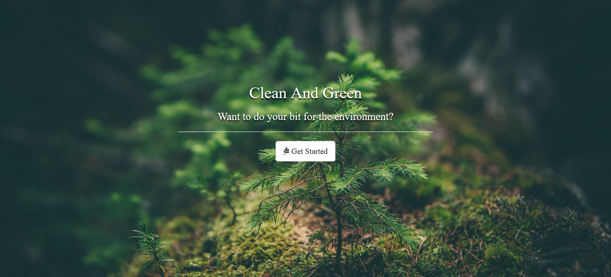

# Clean and green 

<p align="center">
  <a href="#" rel="noopener">
 </a>
</p>


---

> A website that aims at keeping the citizens updated about the upcoming cleaning drives, tree plantation drives and similar campaigns and thus promotes a way to keep the surroundings clean.
---

## Features

- Drives - to organize campaigns
- Maps - location of the drive, also gives location of garbage collection centers 
- Blog - featuring articles as to how one can contribute towards a healthy environment
- "Think Green" feature
- Email upon registration as Volunteer for the campaign

---

## Requirements

- Node.js and Node package manager (npm)
- MongoDB (with path set correctly)

---

## Installation & Setup

```sh
$ git clone https://github.com/ashna111/clean-and-green.git

$ mongod

$ node app.js
```

---

## Contributors

- [Neha Patil](https://github.com/Nehaa-Patil)
- [Rebecca Biju](https://github.com/beccaboo-31)
- [Ashna Shah](https://github.com/ashna111)
